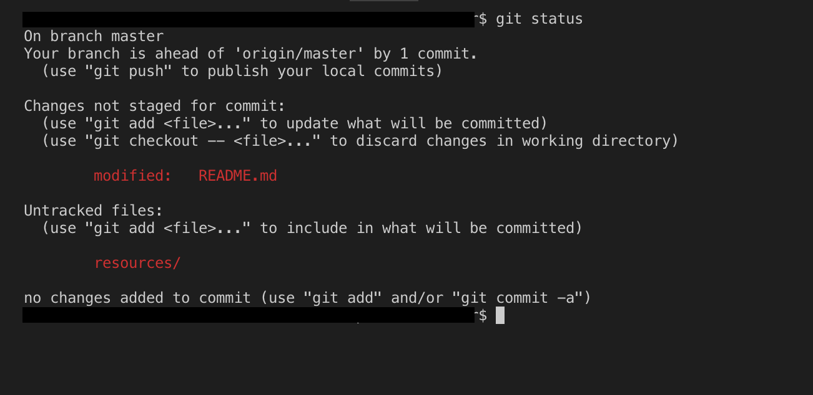
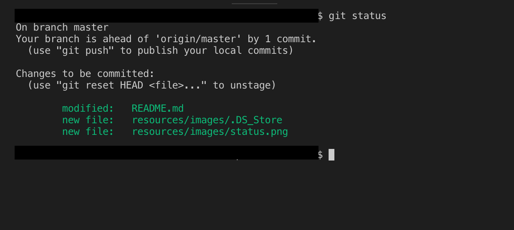
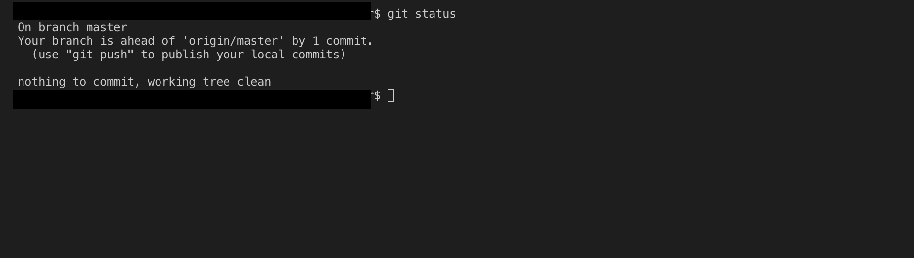

# Introduction to Git

In a nutshell, Git is a distributed source-control or version-control system which helps in keeping track of the changes in source code and also helps developers to coordinate during any software development. To read more about it's origin, design, developers, etc., you can go to this [wikipedia link to git](https://en.wikipedia.org/wiki/Git "wikipedia link to git")

### Topics

* [Git Installation](#Git-Installation "Goto Git Installation")
* [Basic Git Command](#Basic-Git-Command "Goto Basic Git Command")
* [Branching](#Branching "Goto Branching")
* [Stashing](#Stashing "Goto Stashing")
* [Tagging](#Tagging "Goto Tagging")
* [Rebasing](#Rebasing "Goto Rebasing")
    
## Git Installation

Git installation is pretty straight forward.

__On Windows__

You just have to download the installer from [git-scm.com](https://git-scm.com/ "git-scm.com"), and then run it, thats it. Git will be installed.

__On Mac OS__

If you have XCode installed on your MAC then you do not need to do anything, git will already be there, if not then you have to just run command "__git version__" in your terminal and MAC will prompt you to install either XCode or command line developer tools, you can choose to install just command line tools if you dont want to install XCode. 

## Basic Git Command

__git init__

> Create an empty Git repository or reinitialize an existing one

`git init`

As mentioned in the blockquote above this command is use to initialize the git repo. So basically you can use it for different scenarios.

__-> While creating new project__

Just type the below command in your terminal/command prompt

`git init project-name  //you can replace project-name with your own project name`

__->Reinitializing the existing project__

For this scenario you have to first navigate to your project folder, then just type git init.

```
cd project-name 
git init
```
Once you run this command a project folder is setup which contains __.git__ folder this folder keeps the track of the working tree's changes/activities.

__git status__

> Get the working tree status

This command gives the information about the status of working tree compared to git repository. Type the command:

`git status`

and you get information something like below image.



As you can see in the image above, it shows two types of files one is tracked and other is untracked.
Tracked files are those which git is already aware of and are just modified. Untracked files are those which are newly added and git is not keeping track of it.

One more thing to notice in above image is the line "__Your branch is ahead of origin/master by 1 commit__", this is the summary of the current status of the working tree with respect to git repository.

__git add__

> Adding file contents to index/staging area

This command updates the index using the current content found in the working tree, to prepare the content staged for the next commit. Type the command:

`git add file_path`

Multiple file can be added by giving the filenames comma(,) separated.

`git add file1_path,file2_path`

or you can add all files together by using dot(.) in place of filename as:

`git add .`



So if you run `git status` now you will see the files which were previously coming as not staged and/or untracked files in red color, are now coming as staged and ready to commit in green color.

What happens when we run __git add__ is ,the "index" holds the snapshot of the content of working tree, this snapshot is taken as the content for the next commit.

Before running the commit command you can run this command as many times as you want , but after running the commit command if you run this command than content/changes will be staged for the next commit.

__git commit__

> Record changes to the repository(.git folder) but still in the local

This command creates a new commit containing the current contents of the index(the snapshot) and the given log message describing the changes. Just type the command:

`git commit -m "Log Message explaining the change"`

if you miss out giving the log message and just type `git commit` then git will prompt you to add a log message in the default editor configured with git. Now if you run `git status`:



You can see that now our working directory is clean, our changes sits in .git folder which get created at time of __git init__ . Still our changes are in the local , the reason is explained in the next topic below.

basic git flow/first commit, introduce git pull, git push

git clone

adjusting the config with git config

Express commit

git reset

renaming with git mv filename1 filename2

removing file with git rm filename

history

git log
    git log abbrev-commit
    git log --online --graph --decorate
    git log indexM...indexN
    git log --since="3 days ago"
    git log -- sample.txt
    git log --follow -- some.txt

git show

Alias
    git config --global alias.hist "log --all --graph --decorate --oneline"
    git hist

adding .gitignore

## Branching

## Stashing

## Tagging

## Rebasing

